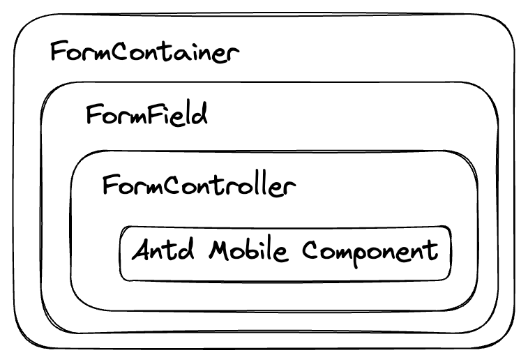

## 业务表单方案介绍

基于[Antd Mobile v5](https://github.com/ant-design/ant-design-mobile)的组件，使用[react-hook-form](https://github.com/react-hook-form/react-hook-form)作为form状态管理，[zod](https://github.com/colinhacks/zod)作为类型校验组合出来的一套业务表单方案

### Why（存在痛点）
由于没有统一业务组件的开发方式，以及各需求开发出很多类似交互的业务组件没有同步，导致项目中存在大量重复封装的业务表单组件，因此需要一个统一的业务表单方案来避免大量重复开发业务通用型表单组件

### What

#### 首先提供两个Form Meta组件

- FormContainer：用于注册整体表单、传递表单context
- FormController：用于控制业务组件，接入后成为受控的表单组件

#### 内置表单域


| 名称 | 场景 |
|---|-------|
| InputField | 适用于文本信息的输入，支持原生type |
| SelectorField | 适用于选项不超过4个的选择一个或多个的表单项 |
| RadioField | 适用于选项不超过5个的单选表单项 |
| PickerField | 适用于选项超过5个，可在弹窗显示可滚动列表的单选表单项 |
| CheckListField | Popup + SearchBar + CheckList组合的表单组件，适用于弹窗展示大列表数据的表单项，支持多选和搜索 |
| CascaderField | 多层级数据单选组件，适用于省市区、公司层级、品类等多层级数据的单选表单项 |
| MultipleCascaderField | 多层级数据多选组件，选择后的结果以tag的形式展现 |
| TextAreaField | 适用于需要折行的长文本输入 |
| DatePickerField | 适用于单个日期的选择，相比CalendarField，日期格式更多，支持年/月/日/时/分/秒/周/礼拜 |
| CalendarField | 适用于单个或区间日期的选择，日期展示格式仅支持年月日 |
| ImageUploaderField | 适用于上传图片的组件，采用原生端上传，可以限制只使用相机拍照 |
| 更多组件 | WIP |


#### 业务编写模式
支持内置组件和自定义两种常规模式来开发业务表单

```jsx
// 内置组件模式
<FormContainer>
  <InputField />
  <SelectorField />
</FormContainer>
```
```jsx
// 自定义模式
<FormContainer>
  <FormController
    render={({
      value,
      onChange,
      ...field
    }) => (
      <Input
        value={value}
        onChange={onChange}
        {...field}
      />
    )}
  />
</FormContainer>
```
想了解更多可以查看[demo](./../../../pages/form/demo/index.tsx)代码

### How



从这张图可以清晰的了解表单组件是如何进行分层的
接下来讲一下设计思路

- `FormContainer`是基于[FormProvider](https://react-hook-form.com/api/formprovider/)创建表单上下文并自动向下传递context，可以让子组件的`Controller`不用手动传递`control`

- `FormController`是基于[useController](https://react-hook-form.com/api/usecontroller/)对表单的label、error、required星标等表单项通用元素的包装

- `FormField`就是内置组件，基于上面的`FormController`和常用的antd mobile的表单组件进行封装，可以减少大量重复工作量，提高业务开发效率，解放生产力专注于业务开发

### Todo
- 增加更多内置组件：
  - [x] `<RadioField />`
  - [x] `<TextAreaField />`
  - [x] `<DatePickerField />`
  - [x] `<CalendarField />`
  - [x] `<ImageUploaderField />`
- 支持更多场景case：
  - [ ] 嵌套表单
  - [ ] 数组表单域
